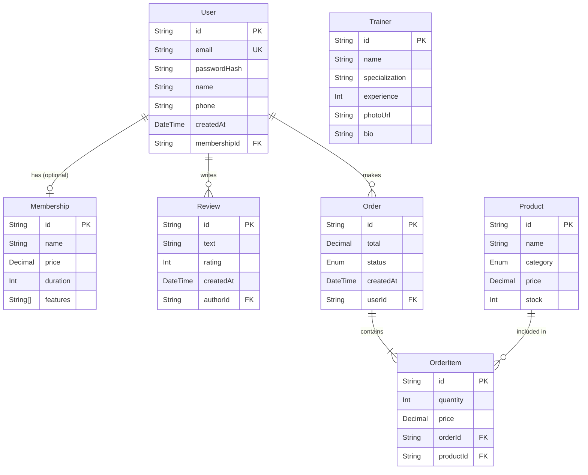

Взаимосвязи между этими сущностями отображены на следующей ER-диаграмме:

```mermaid
erDiagram
    User ||--o| Membership : "has (optional)"
    User ||--o{ Review : "writes"
    User ||--o{ Order : "makes"

    Order ||--|{ OrderItem : "contains"
    Product ||--o{ OrderItem : "included in"

    User {
        String id PK
        String email UK
        String passwordHash
        String name
        String phone
        DateTime createdAt
        String membershipId FK
    }

    Membership {
        String id PK
        String name
        Decimal price
        Int duration
        String[] features
    }

    Trainer {
        String id PK
        String name
        String specialization
        Int experience
        String photoUrl
        String bio
    }

    Review {
        String id PK
        String text
        Int rating
        DateTime createdAt
        String authorId FK
    }

    Product {
        String id PK
        String name
        Enum category
        Decimal price
        Int stock
    }

    Order {
        String id PK
        Decimal total
        Enum status
        DateTime createdAt
        String userId FK
    }

    OrderItem {
        String id PK
        Int quantity
        Decimal price
        String orderId FK
        String productId FK
    }
```
